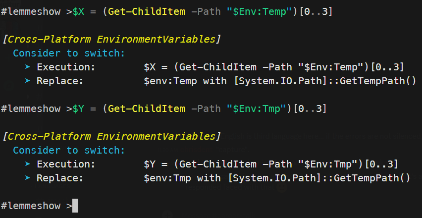

# PSClippy.FBP.CrossPlatform

## The CrossPlatform (Linux, Windows, MAC-OS) FeedbackProvider, for better implementing CrossPlatform Scripts: PSClippy - CrossPlatform

### For getting advices to improve cross platform scripts, while scripting

#### How it works

- Install module 'PSClippy.FBP.CrossPlatform'
- Install module <a href='https://github.com/JustinGrote/ScriptFeedbackProvider/tree/main'>'ScriptFeedbackProvider'</a> by Justin Grote
- Import module 'PSClippy.FBP.CrossPlatform'
- Enable Experimental-Feature <b>PSFeedbackProvider</b>
- Start Scripting

#### Side Notes

This module came up as a mixture of two sessions I´ve seen at the PowerShell + Devops Global Summit in 2024.

[Justin Grote](https://github.com/JustinGrote) introduces in his session how FeedbackProvider in PowerShell works and he showed his ScriptFeedBackProvider Module.

[Dave Caroll](https://thedavecarroll.com/) did a session about cross platform script integration.
